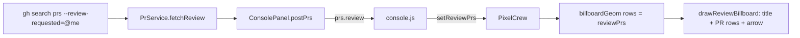
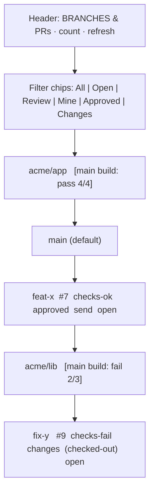

# Branches & PRs Billboard — Task Spec

## Assumptions
- A1: "Keep global" = the single existing panel at its current location (`campusMinX - BB_GAP - BB_W`, left of campus), not one panel per building. Content becomes generic.
- A2: The panel groups rows by repository; each repository group sub-header carries that repo's default-branch build badge (a single shared header cannot represent multiple repos' main builds).
- A3: The view is branch-centric: one row per branch. A branch's open-PR data (number, link, checks, review state) is attached when such a PR exists. Branches without a PR appear only under the "All branches" filter.
- A4: Filters are single-select (one active at a time); default = "All branches". Status checks render per-row in every filter.
- A5: Tracked repositories = the islands ConsolePanel already knows, resolved to `owner/repo` via each island checkout's git remote.
- A6: "Send to worktree" creates the worktree checked out on the existing branch and registers it as a worktree room; it does not auto-spawn a dev (that stays the existing `+ DEV` flow). Filtering is done in the webview from a full dataset (no refetch on filter change).

## Requirements
R1. Replace the global "PRs to review" billboard with a "Branches & PRs" billboard listing git branches across all tracked repos, one row per branch, grouped by repository.
R2. Each branch row shows branch name, repository, and — when the branch has an open PR — the PR number, an open-on-GitHub control, its status-check state (pass/fail/pending/none), and review state (approved/changes/required).
R3. Each repository group sub-header shows a build-status badge for that repo's default branch (pass/fail/pending/none) derived from CI checks on the default branch's latest commit, with check counts.
R4. The header exposes single-select filter chips narrowing rows to: All branches (default), Open PRs, Review requested from me, Created by me, Approved, Changes requested. Applied in the webview without refetch.
R5. The "me" filters (review-requested, created-by-me) resolve against the authenticated GitHub user's login, fetched once and cached.
R6. A branch not already checked out locally exposes a "send to worktree" action that runs `git worktree add <path> <branch>` on the existing branch and persists a worktree room (island, path, branch).
R7. A branch already checked out in a worktree is marked as checked-out and offers no duplicate "send to worktree" action.
R8. Every new clickable control (filter chips, send-to-worktree, refresh, open-in-GitHub) shows `cursor: pointer` and a visible hover state per project UI conventions.
R9. Refresh re-fetches branch/PR/main-build data and spins the refresh glyph while in flight; loading, "GitHub not connected", and empty states render as the current billboard does.
R10. Per-repo fetch uses `gh` and yields, per branch PR: review decision, status-check rollup, author, review requests, comments, updatedAt; main-build status uses check status on the default branch's latest commit.

## Checklist
- [ ] In `git.ts`, add `listBranches(cwd)` (local + remote-tracking branch names) and `worktreeAddExisting(dir, branch)` doing `git worktree add <path> <branch>` without `-b` (R6)
- [ ] In `git.ts`/`github.ts`, add `defaultBranch(repo)` and resolve island path → `owner/repo` via remote (R5, R10)
- [ ] In `prs.ts`, add viewer-login fetch (`gh api user -q .login`) cached once (R5)
- [ ] In `prs.ts`, add per-repo fetch building `RepoGroup{repo, defaultBranch, main<checks counts>, branches:[BranchRow]}`; BranchRow carries branch, hasWorktree, isDefault, and optional PR with `isMine`/`reviewRequestedFromMe` flags reusing existing `rollupChecks`/`reviewCounts` (R2, R3, R10)
- [ ] In `prs.ts`, add default-branch build status via `gh api repos/{owner}/{repo}/commits/{branch}/check-runs` rolled up to pass/fail/pending/none (R3)
- [ ] In `consolePanel.ts`, post `repos: RepoGroup[]` + `viewer` on the existing prs message; add `sendBranchToWorktree` message handler calling `worktreeAddExisting` and persisting the worktree room (R1, R6)
- [ ] In `crew.ts`, replace `setReviewPrs`/`reviewPrs` with `setBranchBoard(repos, viewer)` + a client-side `activeFilter` state (R1, R4)
- [ ] In `crew.ts`, rewrite `billboardGeom()` for grouped rows (repo sub-header rows + branch rows), filter-chip rects, and per-row send/open rects (R2, R3, R4)
- [ ] In `crew.ts`, rewrite `drawReviewBillboard()` → branch board: filter chips, repo group headers with main badge, branch rows with checks/review/send/open glyphs (R2, R3, R8)
- [ ] In `crew.ts`, extend hit-test/`onClick` for filter chips (set `activeFilter`, relayout), send-to-worktree (post message, busy spinner), keeping open-in-GitHub; set pointer cursor on all (R8)
- [ ] In `crew.ts`, preserve loading/disconnected/empty branches in the new layout (R9)
- [ ] In `media/console.js`, route `repos`/`viewer` to `setBranchBoard` and wire a `sendBranchToWorktree` postMessage (R1, R6)
- [ ] `npm run typecheck` and `npm test`; capture before/after PNG of the billboard for the PR body

## Functional Tests
| # | Covers | Input | Expected output |
|---|--------|-------|-----------------|
| 1 | R1,R2 | Repo `acme/app` with branches `main`, `feat-x` (open PR #7, checks pass, approved) | Panel lists both branches under an `acme/app` group; `feat-x` row shows `#7`, ↗ link, pass badge, approved badge |
| 2 | R3 | `acme/app` default branch latest commit: 3 checks pass 1 running | `acme/app` group header badge = pending, counts `3/4` |
| 3 | R3 | Repo with no CI on default branch | Group header badge = none (neutral), no counts |
| 4 | R4 | Dataset of 5 branches, click "Review requested" chip | Only branches whose PR requests viewer's review remain; no refetch issued |
| 5 | R4 | Default load (no chip clicked) | "All branches" active; every branch (PR and PR-less) shown |
| 6 | R4,R2 | Click "Approved" chip | Only branches with an approved PR shown; PR-less branches hidden |
| 7 | R5 | viewer login = `alice`; PR #7 author `alice`, PR #9 author `bob`; filter "Created by me" | Only #7's branch shown |
| 8 | R6 | Click send-to-worktree on `feat-x` (not checked out) | `sendBranchToWorktree{repo,branch:"feat-x"}` posted; worktree created on `feat-x`; building appears for it |
| 9 | R7 | `feat-x` already has a worktree room | Row marked checked-out; no send action rect; hit-test there is inert |
| 10 | R8 | Hover over a filter chip / send / refresh / ↗ | Container cursor = pointer and the control redraws highlighted |
| 11 | R9 | Click refresh | Refresh glyph spins; fetch runs; spinner clears on next data |
| 12 | R9 | No GitHub token | "GitHub not connected" + settings prompt shown, no rows |
| 13 | R9 | Token present, zero branches returned | Empty-state line shown, panel still framed |
| 14 | R10 | PR with 2 approvals, 1 changes-requested, 1 pending reviewer | Row review state reflects changes-requested precedence with correct counts |

## Design

### Before


### After
```mermaid
flowchart LR
  subgraph Host
    R[islands to owner/repo + paths]
    R --> F1[gh pr list per repo: PRs+checks+review+author]
    R --> F2[gh api commits/default/check-runs: main build]
    R --> F3[listBranches per repo]
    V[gh api user to viewer login] --> AGG
    F1 --> AGG[build RepoGroup with BranchRows + isMine/reviewRequested flags]
    F2 --> AGG
    F3 --> AGG
    AGG --> CP[ConsolePanel.postPrs to repos[] + viewer]
    SW[msg: sendBranchToWorktree] --> WA[worktreeAddExisting + persist worktree room]
  end
  CP -->|repos, viewer| JS[console.js: setBranchBoard]
  JS --> CRW[PixelCrew: repos + activeFilter]
  CRW --> BG[billboardGeom: filter chips + repo groups + branch rows]
  BG --> DRAW[draw branch board]
  DRAW -->|chip click| CRW
  DRAW -->|send click| SW
  DRAW -->|arrow click| OPEN[open PR url]
```

### Billboard layout (after)

