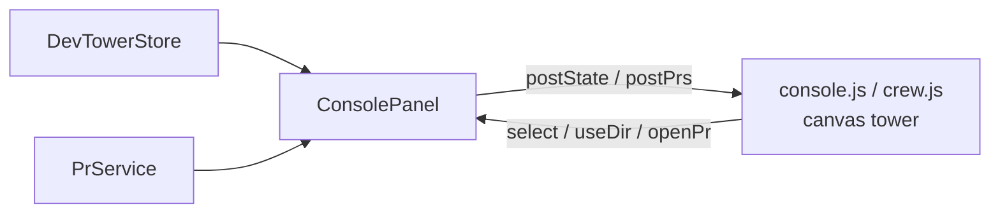
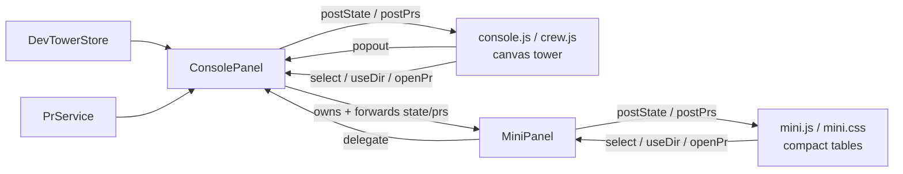
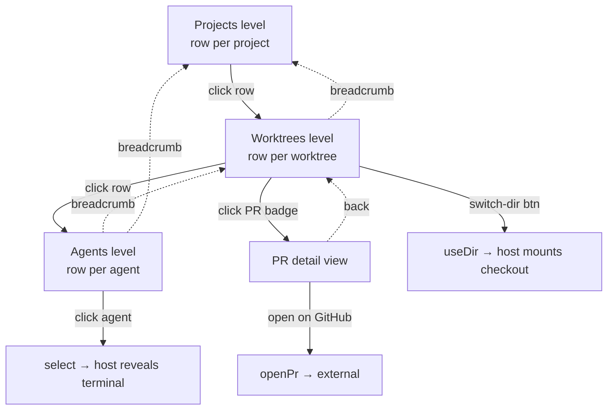
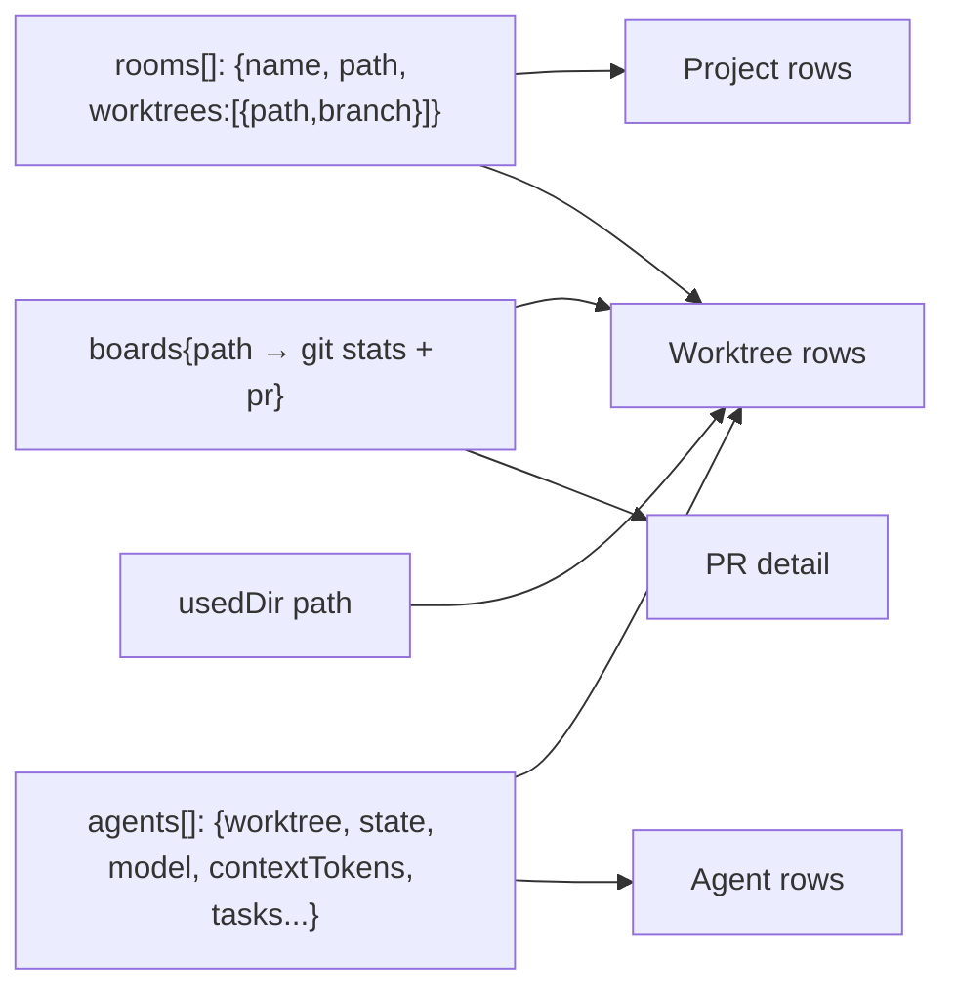

# Mini View (compact popout) — Task Spec

A compact, DOM-table popout of the tower that shows the same agent / worktree /
project / PR information without the canvas scene, so the operator can scan
everything at a glance and switch the active worktree directory quickly.

## Assumptions
(User is away and asked to "design and implement"; recording decisions instead
of blocking on a clarification pass.)

- A1. The popout is a **second `WebviewPanel`** (viewType `devtower.mini`) opened
  beside the tower, so the OS "Move into New Window" gesture makes it a true
  popout. It is **owned by `ConsolePanel`** — the console already polls git/PRs,
  so the mini view reuses that data feed rather than double-polling.
- A2. Closing the tower (ConsolePanel) closes the mini view; the mini view cannot
  outlive its data source. Re-open it with the popout button.
- A3. Three drill levels with breadcrumb nav: **Projects → Worktrees → Agents**,
  plus a **nested PR detail** view reachable from a worktree's PR badge.
- A4. "Switch directory for the worktree" reuses the existing `useDir` action
  (mount that checkout in the Selected Directory view); the currently-mounted
  worktree is marked. No new git behavior is introduced.
- A5. Visual language matches `media/console.css` tokens (dark glass, mono fonts,
  state colors active/wait/complete/error/idle, amber accents).
- A6. The mini view is **read + navigate + switch-dir + open-PR** only. It does
  not add/remove worktrees, spawn devs, push/pull, or stage (those stay in the
  tower) — keeps the compact surface focused on visibility.

## Requirements

R1. The tower HUD shows a **popout control** (an `.iconbtn` beside Settings) with
a pointer cursor and hover feedback; clicking it opens (or reveals) the mini view.

R2. The mini view opens as a separate editor panel titled "DevTower — Mini",
beside the tower, and is revealed (not duplicated) if already open.

R3. The mini view receives the same live data the tower does (agents, rooms,
boards, PRs, selected agent, used dir, telemetry) and updates as that data
changes, with no separate git/PR polling.

R4. **Projects level** lists one row per reserved project (room/island), showing:
project name, worktree count, total agent count, a per-state breakdown
(active / waiting / error), and aggregate git signal (any ahead/behind/dirty) and
open-PR count across its worktrees. Clicking a row drills into that project.

R5. **Worktrees level** lists one row per worktree of the selected project,
showing: branch/label (main vs branch), agent count as `active/total` with
waiting+error pips, git stats (added/deleted lines, modified+staged counts,
ahead/behind/unpushed), and a PR badge (number + checks + review) when a PR is
matched. Clicking a row drills into that worktree's agents.

R6. Each worktree row has a **switch-directory control** that posts `useDir` for
that checkout; the worktree currently mounted (the `usedDir`) is visually marked
as selected and its control reads as active.

R7. **Agents level** lists one row per agent in the selected worktree, showing:
name, state dot + label, model, context-token %, current task, and task
checklist progress (`done/total`) when present. Clicking an agent selects it
(`select` message → reveals its terminal in the host).

R8. A worktree's PR badge opens a **nested PR detail** view showing: PR number +
title, draft flag, checks (pass/fail/running/total), review status
(approved/changes/required) with approvals / changes-requested / reviewers-pending
counts, comment count, and a button to open the PR on GitHub (`openPr`).

R9. A **breadcrumb** (Projects / project / worktree) lets the user navigate back
up; the header also shows the global telemetry pills (run / wait / err / crew)
matching the tower.

R10. Every clickable element (rows, breadcrumb crumbs, switch-dir buttons, PR
badge, back/open-PR buttons) shows `cursor:pointer` and a visible hover state
(per the project's UI conventions).

R11. While the mini view is visible, the host keeps discovery + PR polling alive
even if the tower tab is hidden behind it, so the mini view never goes stale.

R12. If a drilled-into project or worktree disappears from the next state update
(removed worktree/room), the view falls back to the nearest valid level rather
than rendering an empty/broken table.

R13. The `.vsix` packaging stays lean: `media/mini.js` and `media/mini.css` ship
(runtime assets); no new dev artifacts are added to the package.

## Checklist

- [ ] Add `#popoutbtn` `.iconbtn` to the HUD in `consolePanel.ts` `html()` (R1)
- [ ] Wire `popoutbtn.onclick → postMessage({type:"popout"})` in `media/console.js` (R1)
- [ ] Handle `case "popout"` in `ConsolePanel.onMessage` → `this.openMini()` (R2)
- [ ] Create `src/miniPanel.ts`: `MiniPanel` class (WebviewPanel, html, message handler) (R2,R3,R7,R8)
- [ ] `ConsolePanel` owns `mini?`, creates/reveals it, forwards `postState`/`postPrs` payloads to it (R3)
- [ ] Extract `mountSelectedDir(room)` on `ConsolePanel` and call it from both `useDir` and the mini's `useDir` (R6)
- [ ] Route mini `select`/`useDir`/`openPr` back through the console host (R6,R7,R8)
- [ ] Include `mini.visible` in `applyVisibility` so polling stays alive (R11)
- [ ] Dispose mini when console disposes; clear `mini` ref on mini dispose (R2)
- [ ] Build `media/mini.css` from the console token set (glass/mono/state colors) (R5,R10)
- [ ] Build `media/mini.js`: state cache, breadcrumb router, 3 level renderers + PR view (R4,R5,R7,R8,R9,R12)
- [ ] Render projects/worktrees/agents tables with state breakdown + git + PR badges (R4,R5,R7)
- [ ] Mark the mounted `usedDir` worktree + active switch-dir button (R6)
- [ ] Hover/pointer styles on all clickable rows/buttons (R10)
- [ ] Fall back to nearest valid level when the drilled target vanishes (R12)
- [ ] Confirm `.vscodeignore` ships `media/mini.*` and excludes nothing new wrongly (R13)
- [ ] `npm run typecheck` && `npm test` && `npm run build`; capture before/after media

## Functional Tests

| # | Covers | Input | Expected output |
|---|--------|-------|-----------------|
| 1 | R1,R2 | Click the HUD popout button | A "DevTower — Mini" panel opens beside the tower |
| 2 | R2 | Click popout again while mini open | Existing mini panel is revealed, not a second one |
| 3 | R3 | Agent state changes in host | Mini view's counts/rows update without a reload |
| 4 | R4 | Two projects, one with 2 worktrees / 3 agents (1 active,1 wait,1 err) | Projects level shows that project with worktrees=2, agents=3, pips 1/1/1 |
| 5 | R4 | Click a project row | View drills to that project's Worktrees level |
| 6 | R5 | Worktree with 2 agents (1 active) + 4 modified, 2 ahead | Worktree row shows `1/2`, `+/-` lines, modified=4, ahead=2 |
| 7 | R5,R8 | Worktree whose branch has an open PR #42, checks failing | Row shows PR badge `#42` with a failing-checks indicator |
| 8 | R6 | Click switch-dir on a worktree | Host receives `useDir` with that path; row marked selected on next state |
| 9 | R6 | State arrives with `usedDir` = worktree path | That worktree's switch-dir control renders active/selected |
| 10 | R7 | Click a worktree row | View drills to Agents level listing that worktree's agents |
| 11 | R7 | Click an agent row | Host receives `select` with the agent id |
| 12 | R7 | Agent with contextTokens + tasks {done:2,total:5} | Agent row shows context % and `2/5` |
| 13 | R8 | Click a worktree's PR badge | Nested PR view shows number, title, checks, review, comments |
| 14 | R8 | Click "open on GitHub" in PR view | Host receives `openPr` with the PR url |
| 15 | R9 | Any level | Breadcrumb + telemetry pills (run/wait/err/crew) render; crumbs navigate up |
| 16 | R10 | Hover a row / button | Pointer cursor + visible hover (tint/brighten) |
| 17 | R12 | Drilled into worktree, then it's removed from state | View falls back to that project's Worktrees (or Projects) level |
| 18 | R3 | No projects reserved | Projects level shows an empty-state message, not a crash |

## Design

### Before

### After

### Mini view navigation

### Data mapping (host payload → mini level)

