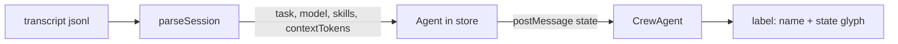
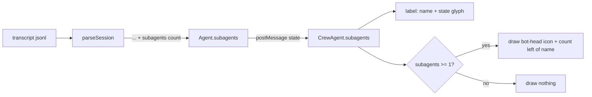

# Sub-Agent Count Badge — Task Spec

## Assumptions
- "Sub-agent" = a child agent spawned via the Task/Agent tool, which Claude Code
  writes into the transcript as a `tool_use` (name `Task`/`Agent`) plus
  `isSidechain:true` turns; sub-agents are NOT promoted to their own toons in the
  scene.
- "Number next to their name" = a small badge (icon + integer) drawn beside the
  existing name label in `crew.ts`, not a new panel.
- Count reflects in-flight sub-agents (spawned, not yet returned), so it rises
  when work fans out and falls to 0 when it settles.

## Requirements
R1. `parseSession` in `src/claude.ts` returns a `subagents: number` = count of
sub-agent (Task/Agent tool) invocations in the read transcript tail that have no
matching `tool_result` yet (in-flight).
R2. A transcript with no Task/Agent `tool_use` records yields `subagents: 0`.
R3. The `Agent` interface (`src/store.ts`) gains `subagents?: number`, populated
from R1 during ingest; absent/0 when unknown.
R4. The webview `CrewAgent` type (`src/webview/crew.ts`) gains
`subagents?: number`, plumbed through the `consolePanel.ts` `state` postMessage
and the `console.js` agent mapping.
R5. When `subagents >= 1`, draw the bot-head icon + count immediately left of the
name label, widening the claimed label box to include the badge; when
`0`/undefined, draw nothing and use the plain name box (no layout shift, no empty
box).
R6. The badge is a distinct new glyph — a pixel **bot head** (square head,
antenna, two eyes) drawn via `ctx.fillRect` pixel art, visually separable from the
existing `? ✓ ✗` state glyph and the selection `▾`.
R7. For external (ghosted) agents the badge renders in the ghost/desaturated
palette, matching the existing name treatment.
R8. The badge is non-interactive (no hit-test/cursor change); it is a passive
indicator only.
R9. `npm run typecheck` and `npm test` pass; `media/crew.js` is rebuilt via
`npm run build` so its diff stays a single minified line.

## Checklist
- [ ] Add `subagents?: number` to `Agent` in `src/store.ts` (R3)
- [ ] In `src/claude.ts` `parseSession`, scan the tail for Task/Agent `tool_use`
  ids and subtract those with a matching `tool_result` `tool_use_id`; return
  `subagents` in the result object (R1, R2)
- [ ] Set `agent.subagents` from the parse result wherever `contextTokens`/
  `skills` are applied during ingest (R3)
- [ ] Add `subagents?: number` to `CrewAgent`; include it in the `consolePanel.ts`
  agents map and the `console.js` `setAgents` mapping (R4)
- [ ] In `crew.ts` label loop (~2207-2279), when `tn.agent.subagents >= 1` draw
  the bot-head icon + count left of the name; widen the claimed box; keep clear of
  the state glyph at `s.x + 10` (R5, R6)
- [ ] Apply ghost color to the badge when `tn.agent.external` (R7)
- [ ] Confirm badge adds no entry to the pointer-move hit-test (R8)
- [ ] `npm run typecheck`, `npm test`, `npm run build`; verify
  `git diff --stat media/crew.js` ~`2 +-` (R9)
- [ ] Capture before/after PNG of the name label for the PR body (UI-change rule)

## Functional Tests
| # | Covers | Input | Expected output |
|---|--------|-------|-----------------|
| 1 | R1 | Transcript tail: 2 `tool_use` name=Task, 0 matching `tool_result` | `subagents === 2` |
| 2 | R1 | Tail: 3 Task `tool_use`, 1 with matching `tool_result` | `subagents === 2` |
| 3 | R2 | Tail with assistant/user turns, no Task tool_use | `subagents === 0` |
| 4 | R3 | Ingest of a parsed session with `subagents:2` | `store.get(id).subagents === 2` |
| 5 | R4 | `state` postMessage for that agent | webview `CrewAgent.subagents === 2` |
| 6 | R5 | CrewAgent `subagents:3`, rendered | badge with bot icon + "3" drawn left of name |
| 7 | R5 | CrewAgent `subagents:0` / undefined | no badge drawn; name label unchanged |
| 8 | R6 | Agent waiting (`?`) with `subagents:2` | both state glyph and agent badge visible, not overlapping |
| 9 | R7 | `external:true`, `subagents:1` | badge rendered in ghost/desaturated color |

## Design
### Before

### After

