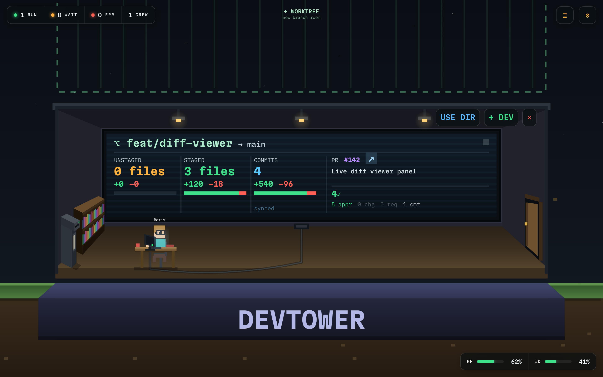
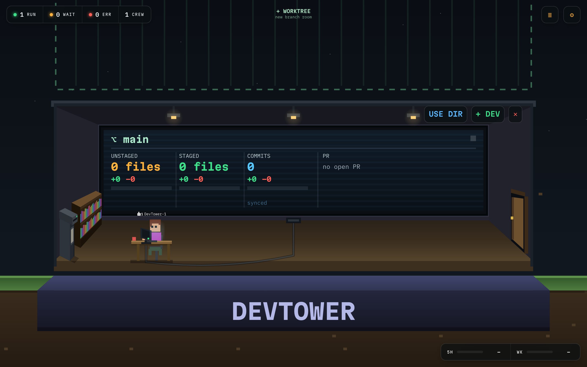

# DevTower

**A pixel office tower for your coding agents.** DevTower turns your repos into a tiny 2D office campus inside VS Code: each repo is a cutaway room, and every live Claude Code session is a pixel dev working at a desk. Spawn new agents into git worktrees, watch them type, see when one needs you, open diffs in the native editor, and review pull requests - all from one playful, low-overhead scene.

## The problem it solves

Running several coding agents means several worktrees, each in its own directory - and the usual workflow is a window (or terminal tab) per directory. You alt-tab to find which session is waiting on input, `cd` around to run `git status` in each, and switch editor windows to review diffs. That context-switching adds up fast once you have more than a couple of agents running.

DevTower collapses it into **a single view**. Every repo and worktree is a room in one campus and every live session a dev at a desk, so you watch **multiple directories and worktrees at once - without switching windows**: who is active, who is blocked waiting on you, who finished or errored, each branch's unstaged / staged / commit counts, and each PR's checks and review status. Click a dev to act on it, click a room to focus its crew, and the diff or terminal you need opens in place. Your crew has a *place* instead of being scattered across windows.

## What you get

- **A living campus.** Each repo is an office room; rooms share walls into one contiguous building. Click a ghost slot to stack the next worktree on top, or reserve another repo as its own tower. New repos animate themselves into existence.
- **Pixel devs per agent.** One sprite per session with a deterministic look. Animation follows state: active types, **waiting raises a hand**, complete cheers, error slumps, idle breathes. Crowded rooms huddle at the whiteboard.
- **Auto-discovered Claude sessions.** Live Claude Code CLI sessions are found from `~/.claude/projects` and placed in the tower automatically - no setup. A phantom-session filter keeps only sessions whose process is actually running.
- **Sub-agent badge.** When a session fans out work with the Task/Agent tool, a small bot glyph and count appear next to the dev - so you can see who has helpers running, including long-lived and background sub-agents.
- **Spawn a dev into a worktree.** Reserve an empty cell, pick a folder, hit **+ DEV**: DevTower creates a git worktree under `.claude/worktrees/` with a Claude-style three-word branch name (like `swift-gliding-heron`), or runs in the project dir, then launches Claude in a native terminal rooted there.
- **Native diffs and terminals.** Click a changed file for the real VS Code diff (HEAD <-> working tree). Each agent gets a native integrated terminal in its worktree - the terminal *is* the conversation.
- **Changes view + a full file viewer.** The selected agent's files split into Staged / Changes with inline stage, unstage, stage-all, and unstage-all, backed by real `git`. A second *Selected Directory* tree lets you browse and edit **any** file in the worktree, **drag to move** files, and **right-click to delete** them - each with a one-time confirm and a "don't ask again" option.
- **Pull requests in-scene.** Each room's board shows its worktree's open PR with the number, title, CI checks, and review status, right next to the branch and change counts. (DevTower won't open a PR for you - just ask the agent in its terminal to create it however you like.)

## Getting started

1. Install DevTower.
2. Open a folder that has (or will have) Claude Code sessions.
3. The **DevTower** console opens automatically. Re-open it any time from the **◆ DevTower** activity-bar icon (`⤢`) or Command Palette -> **DevTower: Open Tower**.
4. To see pull requests and checks, open **Settings** (the ⚙ gear, top right) and add a GitHub token (see below). The tower itself populates as soon as you have a live Claude Code session.

## Requirements and what it accesses

DevTower drives your existing command-line tools and makes **no network calls of its own** (git and gh do their own).

| Tool | Required? | Used for |
|---|---|---|
| **VS Code** 1.85+ | required | host |
| **git** | required | the Changes view, native diffs, `git worktree add`, and per-room push / pull / fetch |
| **Claude Code CLI** (`claude`) | required for live agents | spawning and resuming sessions in terminals; discovering sessions from `~/.claude/projects` |
| **GitHub CLI** (`gh`) | optional | per-room PR status on the board, plus PR view / checkout (DevTower never creates PRs). Authenticated with the token you set in Settings (not your `gh auth login`). Without a token, PR areas show a disconnected placeholder |
| **ps** / **lsof** (macOS / Linux) | optional | showing only sessions whose `claude` process is still running, counted per directory. On **Windows**, DevTower counts running `claude` processes tower-wide via WMI (PowerShell) and caps shown sessions to that many; if unavailable it uses a freshness fallback |

**What it reads and writes:**

- Reads `~/.claude/projects/*/*.jsonl` transcripts to discover sessions and show each agent's model, branch, token usage, and last activity.
- Reads and writes the state feed file (`devtower.stateFile`, default `.devtower/state.jsonl`).
- Reads working-tree files and `git show HEAD:<file>` to render diffs.
- Creates git worktrees (PR reviews go under `.claude/worktrees`) and runs `git` / `gh` / `ps` / `lsof`.
- Spawns one VS Code integrated terminal per agent.

> On macOS, launch VS Code from a terminal so the extension host inherits your shell `PATH`; otherwise `claude` and `gh` may not be found.

## GitHub access and token storage

PR features authenticate with a GitHub **Personal Access Token** you add in the DevTower settings page (the ⚙ gear, top right). Your token is **stored securely in VS Code's [SecretStorage](https://code.visualstudio.com/api/references/vscode-api#SecretStorage)**, which is backed by your operating system's credential vault - macOS **Keychain**, Windows **Credential Manager**, or **libsecret / gnome-keyring** on Linux. It is encrypted at rest and is **never** written to `settings.json`, the workspace, or the repo.

DevTower uses the token only inside the extension: it is passed to the `gh` subprocess it spawns (via the `GH_TOKEN` environment variable) and is never sent to the webview, your agent terminals, git, or any network call DevTower makes itself. The settings page recommends a **fine-grained, read-only** token scoped to just the repositories you choose; you can review which features your token unlocks, and remove it, from the same page.

## A look around

The campus at a glance - telemetry across every room and each room's live board, all in one window:

A single room: the worktree's board (branch, unstaged / staged / commit counts, PR cell), the **USE DIR** and **+ DEV** controls, the ghost slot to stack the next worktree, and the dev at their desk (here with a sub-agent badge):

The agent panel - context-window bar, model, skills, a button into the agent's Claude terminal, and a link to its PR when one exists:

The GitHub access page - connected account, scopes, the features your token unlocks, and pre-filled links to mint a fine-grained read-only token:

## Settings

| Setting | Default | What it does |
|---|---|---|
| `devtower.stateFile` | `.devtower/state.jsonl` | Append-only JSONL feed agents write state events to. |
| `devtower.discoverClaudeSessions` | `true` | Scan `~/.claude/projects` for live Claude Code sessions. |
| `devtower.pollIntervalMs` | `8000` | How often to rescan for live sessions. |
| `devtower.sessionMaxAgeHours` | `24` | How far back to scan transcripts for sessions. |
| `devtower.showRecentSessions` | `false` | Also show recent sessions with no running process (as idle rooms). |
| `devtower.performanceMode` | `balanced` | Animation frame rate / particle detail: `smooth` (15 fps), `balanced` (10 fps), or `eco` (6 fps, lowest CPU). Pick from the tower's Settings. |
| `devtower.claudeCommand` | `claude` | Command launched in a new agent's terminal. |
| `devtower.launchCommand` | `` | Overrides `claudeCommand`; placeholders `${worktree}`, `${branch}`, `${id}`. |
| `devtower.reviewSkills` | code-review, security-review, review, simplify, verify | Skills offered as chips in the Review Dispatch card. |
| `devtower.reviewDefaults` | `{}` | Saved skills / effort / instructions for the Review Dispatch card. |

## Issues and support

Open an issue at [github.com/BradenTerry/DevTower/issues](https://github.com/BradenTerry/DevTower/issues).

## License

[MIT](https://github.com/BradenTerry/DevTower/blob/main/LICENSE)
