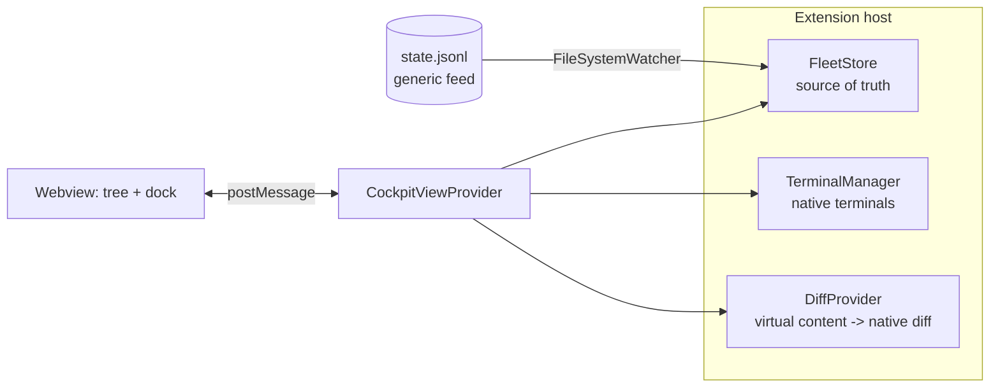

# DevTower

A pixel office tower (VS Code extension) for your coding agents. Each repo is a room in a 2D campus grid — build up, dig down, expand sideways. Live **Claude Code CLI sessions are auto-discovered** from `~/.claude/projects` and appear as pixel devs at their desks; reserve empty cells for directories and spawn new agents into **git worktrees** or the project dir. Diffs open in the **native** VS Code diff editor; each agent gets a **native** integrated terminal rooted in its worktree.

## Run it

```bash
npm install
npm run watch        # or: npm run compile
```

Press **F5** (Run Fleet Extension) to launch an Extension Development Host. The **Fleet Console** (the 3D view) opens automatically. Re-open it any time from the **◆ Fleet** activity-bar view's title (`⤢`) or Command Palette → **Fleet: Open Console**.

> After rebuilding, reload the Extension Development Host (**Cmd/Ctrl+R** in that window) so it runs the new bundle.

Ships with mock agents so you can try the whole loop immediately:

- **Fleet Console** (the 3D interface):
  - A Three.js scene of **voxel characters**, one per agent, with a deterministic look (hue/hat/accessory from the agent id).
  - **Grouped by file path**: each repo is a **floating grassy island** (trees, dirt underside, nameplate) joined by rope bridges. Agents on the same worktree stand together; a new agent **walks onto** its island and a removed one **walks off and fades**.
  - **State-driven animation**: active types with swinging arms, waiting raises a hand and waves, complete cheers and hops, error slumps, idle breathes.
  - **Click a character** to select it. An overlay **control card** appears with state-aware actions:
    - *Awaiting input* → Approve / Request changes / Answer (composer glows).
    - *Active* → Queue / Interrupt. *Complete* → New task. *Error* → Retry / Send fix.
    - Typing + ⏎ writes to the agent's terminal and flips it back to **active**.
    - Card tools: **Session** (slide-in conversation panel), **Diff →** (native diff editor, opens to the right), **Terminal** (native, in the worktree).
- **Changes view** (native tree, in the ◆ Fleet activity-bar):
  - Selected agent's changed files, split into **Staged Changes** and **Changes**.
  - Inline **stage** (`+`) / **unstage** (`−`); **stage all** / **unstage all** in the title bar.
  - Click a file → **native diff** (HEAD ↔ working tree). Live `git status` for real worktrees; read-only list for mock agents.

### Real git, real terminals

- The Changes view runs `git status --porcelain` in the selected agent's resolved worktree, and stage/unstage call `git add` / `git reset HEAD`. Diffs read `git show HEAD:<file>` for the left side and the working file for the right (edits in the diff write to disk).
- Each agent gets a terminal rooted in its worktree (`cwd`). Set **`fleet.launchCommand`** to run a command on first open — e.g. to resume an agent session — so that subsequent sends go to that process. Placeholders: `${worktree}`, `${branch}`, `${id}`.

## Architecture



- `src/fleet.ts` — agent model, mock seed, and the `state.jsonl` watcher.
- `src/cockpitView.ts` — webview view provider + message bridge.
- `src/terminals.ts` — one native terminal per agent.
- `src/diffProvider.ts` — virtual content provider feeding the native diff editor.
- `media/cockpit.{css,js}` — the skinned tree + interaction dock (light/dark, high contrast).

## Wiring real agents (next step)

State comes from a generic append-only JSONL file (`fleet.stateFile`, default `.fleet/state.jsonl`). Any runner — Claude Code hooks, a shell wrapper, CI — appends one JSON event per line:

```json
{"id":"a1","name":"streamer","repo":"atlas-api","worktree":"../wt/feat-sse","branch":"feat/sse","state":"active","task":"wiring SSE","elapsed":"2m"}
{"id":"a1","state":"waiting","task":"needs a decision on rotation"}
```

The watcher ingests changes live and the cockpit re-renders. Set `fleet.useMockData` to `false` to run purely off the feed.

### Claude Code hooks (auto state)

`hooks/fleet-emit.mjs` turns Claude Code lifecycle hooks into Fleet state events. It reads the hook payload on stdin, derives the agent's identity from its git worktree, maps the event to a state, and appends a line to the feed:

| Hook event | State |
|---|---|
| `UserPromptSubmit`, `PreToolUse`, `PostToolUse`, `SubagentStop` | active |
| `Notification` (needs permission/attention) | waiting |
| `Stop`, `SessionStart`, `SessionEnd` | idle |

Copy the hooks from `hooks/claude-settings.sample.json` into your project's `.claude/settings.json` (fix the absolute path if you moved the repo). Override the feed location with `FLEET_STATE_FILE`; otherwise it writes `<git toplevel>/.fleet/state.jsonl`.

```bash
# one emitter handles every event — it switches on hook_event_name
echo '{"hook_event_name":"Notification","cwd":"'$PWD'","session_id":"s1","message":"needs permission"}' \
  | node hooks/fleet-emit.mjs
```
