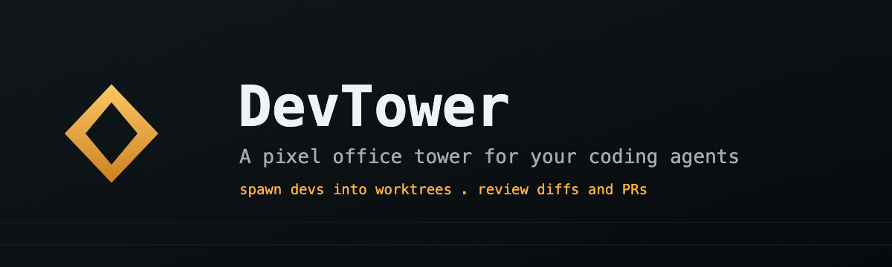
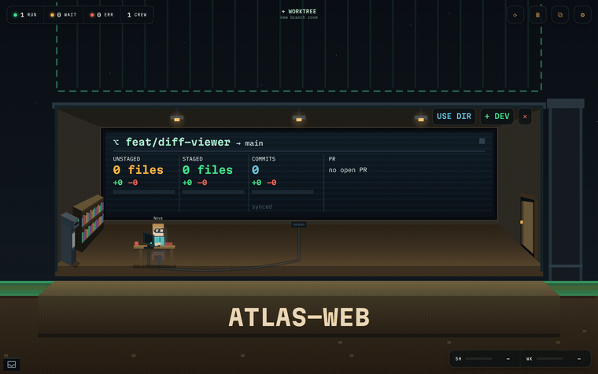
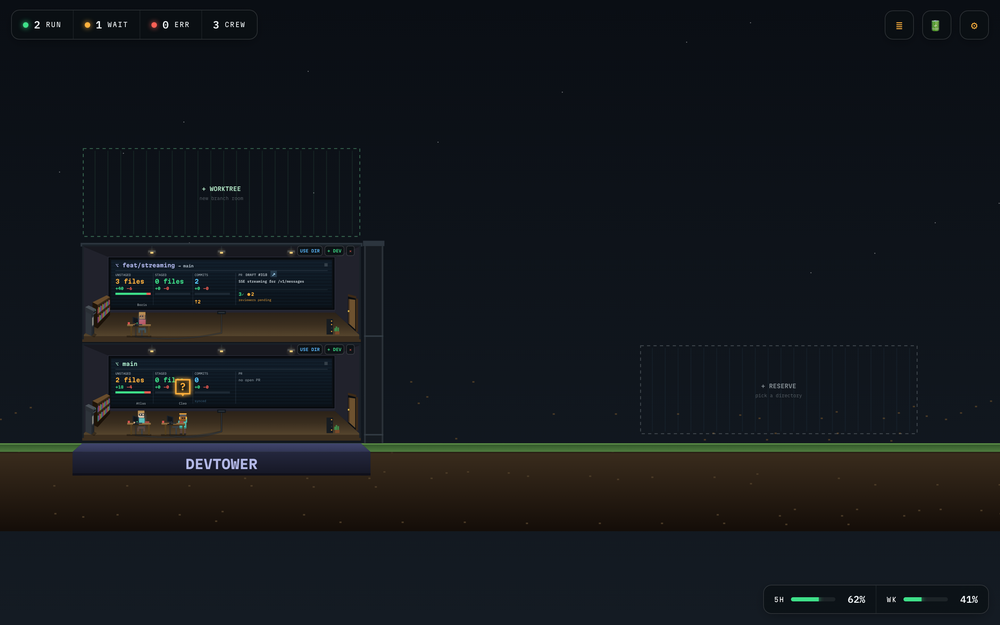
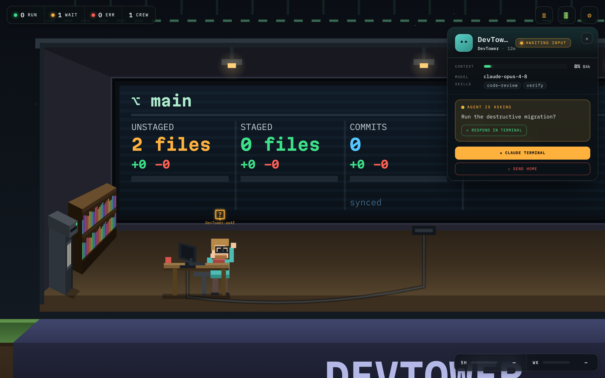
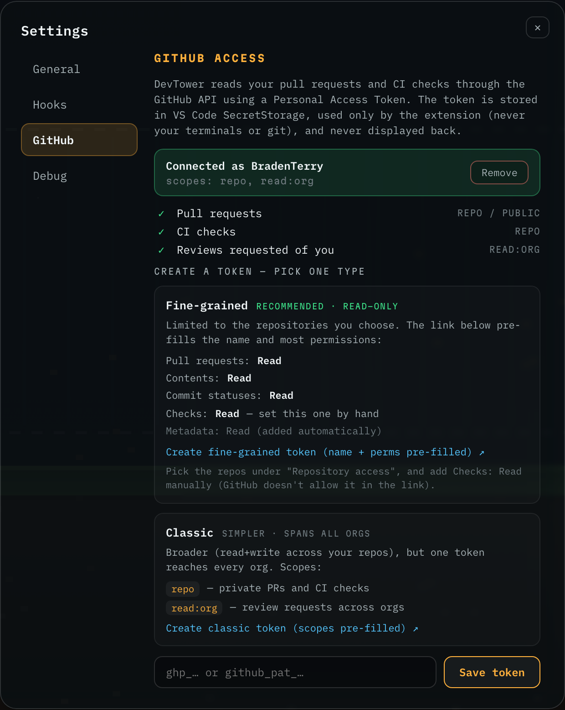
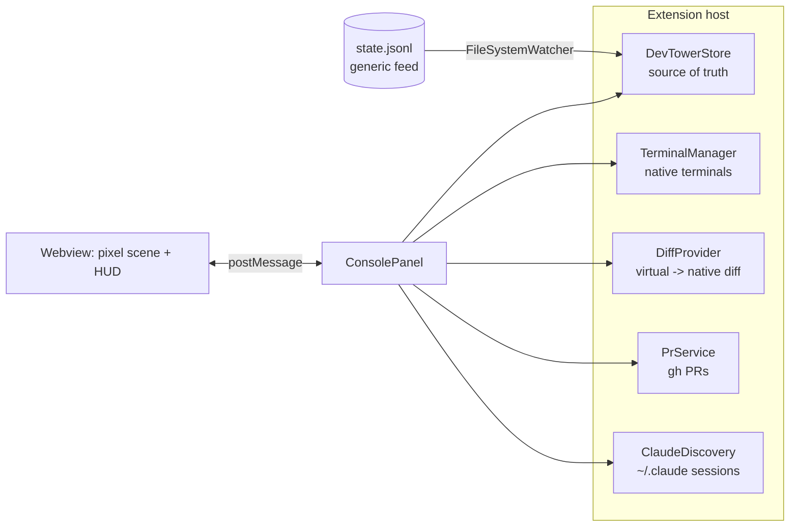

# DevTower

A pixel office tower (VS Code extension) for your coding agents. Each repo is a cutaway **room** whose worktrees stack into a tower, floor by floor. Live **Claude Code CLI sessions are auto-discovered** from `~/.claude/projects` and appear as pixel devs at their desks. Reserve empty cells for directories and spawn new agents into **git worktrees** or the project dir. Diffs open in the **native** VS Code diff editor; each agent gets a **native** integrated terminal rooted in its worktree; pull requests show on an in-scene **PR board** and you can dispatch a reviewer agent straight from a PR row.



> DevTower is an early **Preview** release on the VS Code Marketplace. See [Releasing](#releasing).

## The problem it solves

Running several coding agents means several worktrees, each in its own directory - and the usual workflow is a window (or terminal tab) per directory. You alt-tab to find which session is waiting on input, `cd` around to run `git status` in each, and switch editor windows to review diffs. That context-switching adds up fast once you have more than a couple of agents running.

DevTower collapses it into **a single view**. Every repo and worktree is a room in one campus and every live session a dev at a desk, so you watch **multiple directories and worktrees at once - without switching windows**: who is active, who is blocked waiting on you, who finished or errored, each branch's unstaged / staged / commit counts, and each PR's checks and review status. Click a dev to act, click a room to focus its crew, and the diff or terminal you need opens in place.



## Run it

```bash
npm install
npm run watch        # or: npm run compile
```

Press **F5** (Run DevTower Extension) to launch an Extension Development Host. The **DevTower** console opens automatically. Re-open it any time from the **◆ DevTower** activity-bar view's title (`⤢`) or Command Palette -> **DevTower: Open Tower**.

> After rebuilding, reload the Extension Development Host (**Cmd/Ctrl+R** in that window) so it runs the new bundle.

To see PRs and checks, add a GitHub token in **Settings** (the ⚙ gear, top right) - see [GitHub access and token storage](#github-access-and-token-storage). The tower populates from real Claude Code sessions; DevTower ships no mock data.

## What's in the tower

- **The campus** (Canvas2D pixel scene): each repo is a cutaway office room - tinted walls, dusk window, whiteboard, desks/monitors, a plant, and hash-picked decor. Rooms stack into a tower, sharing floors and ceilings; a **ghost slot** on top of each tower lets you stack the next worktree, and a reserve slot lets you add another repo as its own tower.
- **Pixel devs**: one sprite per agent with a deterministic persona (hair/shirt/cap/glasses from the id hash). State drives the animation - active types, waiting raises a hand, complete cheers, error slumps, idle breathes. Two or more active agents in a room huddle at the whiteboard.
- **Arrivals/departures**: a joining agent walks in through the door (with a room construction animation on a new repo); a leaver walks to the edge, climbs a fire-escape ladder down, and an emptied room deconstructs after they exit.
- **Click a dev** to select it (amber ring) and open the agent panel. Click a room to zoom to its crew, click away for the overview; scroll to zoom, click-drag to pan.
- **Sub-agent badge**: when a session fans out work (the Task/Agent tool), a small bot glyph + count appears beside the dev's name, so you can see at a glance who has helpers in flight - including long-running and background sub-agents.
- **Agent panel**: context-window % bar + token count, model, branch, skills, a live "now" strip of what the agent is doing/asking, state-aware quick actions (Approve / Request changes when waiting), and a button to open its Claude terminal or jump to an existing PR. A composer sends text to the agent's terminal. (There is no "create PR" button - prompt the agent to open the PR however you want it.)



- **Changes view** (native tree in the ◆ DevTower activity-bar): the selected agent's files split into **Staged Changes** and **Changes**, inline stage (`+`) / unstage (`-`), stage all / unstage all, and click-to-diff (native HEAD <-> working tree).
- **File viewer** (the *Selected Directory* tree): browse and open **any** file in the focused room's worktree, not just changed ones - editable, in this window, without touching your workspace folders. **Drag a file or folder onto another folder to move it**, or **right-click -> Delete** (sent to the OS Trash). Each action confirms once and offers **"don't ask again"** (reset later with **DevTower: Reset File Prompt Confirmations**). Press a room's **USE DIR** button to point the viewer at that worktree.
- **PR status on every board**: per-worktree pull requests via `gh`, with the open PR's number, title, CI checks, and review status shown right on each room's board (and a disconnected placeholder when no GitHub token is set).

See [FEATURES.md](FEATURES.md) for the full capability map and the data-core / presentation split.

## Files: browse, move, delete, diff

The two trees in the **◆ DevTower** activity-bar container turn the focused worktree into a place you can actually work, without opening a second window:

- **Selected Directory** is a full file viewer for the worktree (every file, not just changed ones). Open a file to edit it inline; **drag** a file or folder onto a folder to move it; **right-click -> Delete** to send it to Trash. Both moving and deleting confirm once, with a **"don't ask again"** option.
- **Changes** is the SCM-style split of staged / unstaged changes for the same worktree, with inline stage/unstage and click-to-diff into the native VS Code diff editor.

## Real git, real terminals, real PRs

- The Changes view runs `git status --porcelain` (+ numstat) in the selected agent's resolved worktree; stage/unstage call `git add` / `git reset HEAD`. Diffs read `git show HEAD:<file>` for the left side and the working file for the right.
- Each agent gets a terminal rooted in its worktree (`cwd`). Set **`devtower.launchCommand`** to run a command on first open (e.g. resume a session) so subsequent sends reach that process. Placeholders: `${worktree}`, `${branch}`, `${id}`.
- Spawning a dev into a room either creates a git worktree (`git worktree add` under `.claude/worktrees/<slug>` with a `devtower/<slug>` branch, where `<slug>` is a Claude-style three-word name like `swift-gliding-heron` - unique and collision-checked) or runs in the project base dir, then launches `devtower.claudeCommand` in its terminal.
- PR features shell out to the GitHub CLI (`gh pr list --head <branch>`, `gh search prs --review-requested=@me`, `gh pr checkout`). DevTower does not open PRs for you - prompt the agent in its terminal to create the PR exactly how you want it.

## Requirements and what it runs on your machine

DevTower drives your existing CLIs; it makes no network calls of its own (git/gh do their own).

| Tool | Required? | Used for |
|---|---|---|
| **VS Code** 1.85+ | required | host |
| **git** | required | Changes view, native diffs, `git worktree add`, per-room push/pull/fetch |
| **claude** ([Claude Code](https://claude.com/claude-code) CLI) | required for live agents | spawning/resuming sessions in terminals (`devtower.claudeCommand`); session discovery reads `~/.claude/projects` transcripts |
| **gh** ([GitHub CLI](https://cli.github.com)) | optional | Per-worktree PR status on each board, PR view/checkout (DevTower never creates PRs). Authenticated with the token you set in Settings (not your `gh auth login`). Without a token, PR areas show a disconnected placeholder |
| **ps** / **lsof** (macOS / Linux) | optional | phantom-session filter - show only sessions whose `claude` process is still running, counted per directory. On **Windows**, DevTower instead counts running `claude` processes tower-wide via WMI (`Get-CimInstance Win32_Process`) and caps shown sessions to that many, newest-first; if even that is unavailable it falls back to a 15-min freshness window |

What it accesses currently:

- **Reads** `~/.claude/projects/*/*.jsonl` transcripts (cwd, model, usage, last role) to discover and describe live sessions.
- **Reads/writes** the state feed file (`devtower.stateFile`, default `.devtower/state.jsonl`) via a `FileSystemWatcher`.
- **Reads** working-tree files and `git show HEAD:<file>` to render diffs.
- **Creates** git worktrees (under `.claude/worktrees` for PR review) and runs `git` / `gh` / `ps` / `lsof` subprocesses.
- **Spawns** one VS Code integrated terminal per agent and runs the configured launch command in it.

On macOS, launch VS Code from a terminal so the extension host inherits your shell `PATH`; otherwise `claude` / `gh` may not be found.

## GitHub access and token storage

PR features authenticate with a GitHub **Personal Access Token** added in the DevTower settings page (the ⚙ gear, top right). The token is **stored in VS Code [SecretStorage](https://code.visualstudio.com/api/references/vscode-api#SecretStorage)** (`context.secrets`), which is backed by the OS credential vault - macOS **Keychain**, Windows **Credential Manager**, or **libsecret / gnome-keyring** on Linux. It is encrypted at rest and is never written to `settings.json`, the workspace, or the repo.



The token is used only inside the extension: it is passed to the spawned `gh` subprocess via the `GH_TOKEN` environment variable (which overrides any `gh auth login`), and is never sent to the webview, agent terminals, git, or any DevTower network call. On save, DevTower probes the token to show the account, its scopes, and which features it unlocks. The page recommends a **fine-grained, read-only** token scoped to chosen repos; you can remove it there at any time.

## Architecture



| Layer | Files |
|---|---|
| Data core | `src/store.ts` (DevTowerStore + `state.jsonl` watcher), `src/git.ts`, `src/prs.ts`, `src/claude.ts`, `src/session.ts`, `src/terminals.ts`, `src/diffProvider.ts`, `src/changesView.ts` |
| Bridge | `src/consolePanel.ts` (webview provider + message bridge) |
| Presentation | `src/webview/crew.ts` (pixel scene, bundled to `media/crew.js`), `media/console.{css,js}` |

The data core and the webview message contract are theme-agnostic; the pixel scene is a presentation layer that can be reskinned without touching them.

## Wiring real agents

State comes from a generic append-only JSONL file (`devtower.stateFile`, default `.devtower/state.jsonl`). Any runner - Claude Code hooks, a shell wrapper, CI - appends one JSON event per line:

```json
{"id":"a1","name":"streamer","repo":"atlas-api","worktree":"../wt/feat-sse","branch":"feat/sse","state":"active","task":"wiring SSE","elapsed":"2m"}
{"id":"a1","state":"waiting","task":"needs a decision on rotation"}
```

The watcher ingests changes live and the scene re-renders off the feed and live session discovery.

### Claude Code hooks (auto state)

`hooks/devtower-emit.mjs` turns Claude Code lifecycle hooks into DevTower state events. It reads the hook payload on stdin, derives the agent's identity from its git worktree, maps the event to a state, and appends a line to the feed:

| Hook event | State |
|---|---|
| `UserPromptSubmit`, `PreToolUse`, `PostToolUse`, `SubagentStop` | active |
| `Notification` (needs permission/attention) | waiting |
| `Stop`, `SessionStart`, `SessionEnd` | idle |

Copy the hooks from `hooks/claude-settings.sample.json` into your project's `.claude/settings.json` (fix the absolute path if you moved the repo). Override the feed location with `DEVTOWER_STATE_FILE`; otherwise it writes `<git toplevel>/.devtower/state.jsonl`.

```bash
# one emitter handles every event - it switches on hook_event_name
echo '{"hook_event_name":"Notification","cwd":"'$PWD'","session_id":"s1","message":"needs permission"}' \
  | node hooks/devtower-emit.mjs
```

## Releasing

DevTower follows a tag-driven release to the VS Code Marketplace (regular channel; the `preview` flag in `package.json` only badges the listing while features settle; it does not gate installs).

The git tag is the single source of truth for the version (the committed `version` is a placeholder). Pushing a `v*` tag runs `.github/workflows/release.yml`, which typechecks, builds, packages the `.vsix` (using `MARKETPLACE.md` as the Marketplace readme), creates a GitHub release with the `.vsix` attached, and publishes to the Marketplace when the `VSCE_PAT` secret is set.

```bash
git tag v0.1.0 && git push origin v0.1.0
```

Build a `.vsix` locally with `npm run package`.

## License

[MIT](LICENSE)
