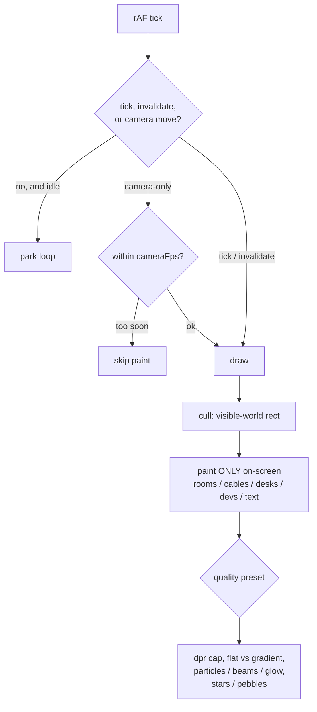

# DevTower performance

The tower is a `<canvas>` scene (`src/webview/crew.ts`). This note covers how it
stays cheap, the knobs for weak GPUs, and how to diagnose a slow machine.

## Render model

The animation loop only paints when something is moving and **parks when the
scene is idle** (`sceneIdle()`), so a still tower costs nothing. While agents are
active it repaints, and the cost of each repaint is what matters on weak hardware.



## What keeps a repaint cheap

1. **Viewport culling.** Each frame computes the visible world rect and skips
   every island, room, cable, desk, dev, shaft, ghost, particle, and the
   screen-space text pass that falls off-screen. Cost scales with what's on
   screen, not the size of your campus. Zoomed into one building, ~3 rooms paint
   instead of the whole campus. This is exact: pixel-identical to no culling
   (`node screenshots/cull-check.js` proves it).
2. **Camera-fps cap.** A pan/zoom/focus glide repaints at `cameraFps`, not at the
   monitor's refresh rate. The tween still advances every frame, so motion stays
   smooth-looking while costing far fewer full-scene redraws.

## Graphics quality presets

Settings → General → **Graphics quality** (persisted as `devtower.graphicsQuality`).

| Preset | Resolution | Effects | Anim / Camera fps | Use when |
| --- | --- | --- | --- | --- |
| High | native (up to 2x) | all | 15 / 60 | strong GPU, want the smoothest motion |
| Balanced (default) | native (up to 2x) | all | 10 / 60 | most machines |
| Low | **1x** | no particles, no glow | 8 / 30 | weak / integrated GPU |
| Potato | **1x** | flat colors, no particles / cable beams / stars | 6 / 24 | the weakest hardware |

High and Balanced render the classic scene (identical pixels; only the frame rate
differs). Low and Potato trade detail for speed. The biggest single win on a
high-DPI display is the **1x render scale**: a 2x (retina / scaled 4K) backing
store has four times the pixels to fill, and dropping to 1x roughly doubles the
achievable frame rate before any effect is touched.

## Diagnosing a slow machine

1. **Performance overlay** — Settings → Debug → *Performance overlay*
   (`devtower.perfHud`). Draws live FPS, per-frame draw cost (p50 / p95 ms), how
   many rooms/devs are being drawn vs the total (culling ratio), particle/packet
   counts, the active dpr, and the quality preset, in the bottom-left corner.
2. **Debug log** — turn on Settings → Debug → *Debug logging*
   (`devtower.debugLog`). A `perf.sample` event is written to `debug.log` every
   ~2s with the same numbers, so a slow session can be analysed after the fact
   without a profiler.

If the overlay shows a low FPS with a high draw-ms, drop the graphics quality. If
it shows `rooms 80/80` you are zoomed out over the whole campus (overview is the
worst case); zooming into the building you're working in is dramatically cheaper.

## Tests and benchmark

`npm run perf:test` is the regression guard. It boots the real bundle and counts
the **canvas draw operations** issued per frame with culling off vs on and per
preset. Operation counts don't vary by hardware, so the assertions ("zoomed in
does a fraction of the work", "Potato issues fewer ops than High") are stable in
CI. It also proves culling is **pixel-identical** to no-culling for the visible
area (`setCull(false)` reproduces the old full-scene draw). These run under
Playwright, not vitest, because they need a real `<canvas>`.

`npm run bench` boots the real bundle in headless Chromium, builds a heavy campus
of active agents, and measures `draw()` self-time per preset at dpr 1 and 2, for
an overview and a focused camera. It writes `screenshots/out/bench.json`.

```
BENCH_BUILDINGS=20 BENCH_FLOORS=4 npm run bench         # heavier campus
BENCH_PRESETS=high,potato BENCH_DPR=2 npm run bench     # subset
node screenshots/bench-compare.js before.json after.json
```

The numbers are hardware-relative (they reflect the machine running them), so the
signal is the **before/after delta** and the **focused-vs-overview gap**, not the
absolute milliseconds. On the dev machine, culling alone took the focused work
view from ~5.6 ms to ~0.4 ms per frame (14x) with no visual change.
